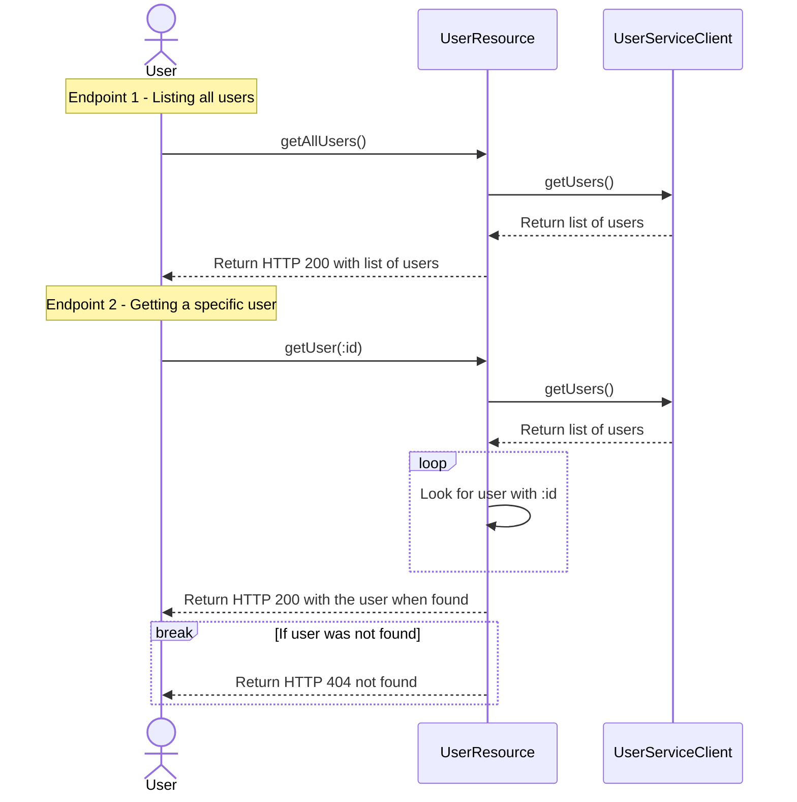

# IM-Recruitment
Repository for recruitment purposes in Industry Messaging

## Prerequisites for solving task
You only need Java 21 installed to complete the task. The project includes Maven Wrapper so you can start by running 
the terminal commands below. Verify that you can compile and run tests successfully before you continue with the task.  Good Luck!

```bash
# start by entering the caching project folder
cd ./caching

# build and run all tests (should be successful)
./mvnw clean verify

# start Quarkus in dev-mode so you can do live coding with your favourite editor
./mvnw quarkus:dev

# use the swagger-ui in your browser to test the api ...
open http://localhost:8080/q/swagger-ui/

# ... or just use curl from command line
curl -i http://localhost:8080/users
curl -i http://localhost:8080/users/3
```

## Task description
You are given a REST API that needs refactoring. The API is slow and you are tasked with improving its performance using caching to avoid overloading and unnecessary calling the External API

- The [UserResource](./caching/src/main/java/org/tietoevry/UserResource.java) is our REST API exposing two simple endpoints returning user details
  - Endpoint for listing all users, which delegate calls to an external rest service to fetch users
  - Endpoint for getting a specific user by looping through all users looking for a matching ID
- The [UserServiceClient](./caching/src/main/java/org/tietoevry/UserServiceClient.java) is our client that calls an External API on the Internet to [fetch users](https://jsonplaceholder.typicode.com/users).



## Requirements
- Continue using our Quarkus app as the framework and Java as the language
- Add a caching layer to the REST API with the following requirements :
  - A response containing the requested data must always, under all circumstances, arrive immediately.
  - It is acceptable for the response data to be stale.
  - Maximum staleness time must be configurable.
  - You are not allowed to modify the third-party API URL or the [UserServiceClient](./caching/src/main/java/org/tietoevry/UserServiceClient.java).
  - You are not allowed to use built in caching dependencies, 3rd party caching libraries or caching annotations like `quarkus-cache`, `caffein` or `@Cached`.
- In case of doubt, come up with a solution of your choice.
- This task should take you maximum 1-2 hours.

## Example responses from our REST API endpoints
Return all users in an array :
```shell
curl http://localhost:8080/users
```
Result:
```json
[
  {
    "id": 1,
    "name": "Leanne Graham",
    "username": "Bret",
    "email": "Sincere@april.biz",
    "phone": "1-770-736-8031 x56442",
    "website": "hildegard.org"
  },
  {
    "id": 2,
    "name": "Ervin Howell",
    "username": "Antonette",
    "email": "Shanna@melissa.tv",
    "phone": "010-692-6593 x09125",
    "website": "anastasia.net"
  },
  {
    "id": 3,
    "name": "Clementine Bauch",
    "username": "Samantha",
    "email": "Nathan@yesenia.net",
    "phone": "1-463-123-4447",
    "website": "ramiro.info"
  },
  ... and seven more
]
```
---
Returns a user with a specified id :
```shell
curl http://localhost:8080/users/1
```
Result:
```json
{
    "id": 1,
    "name": "Leanne Graham",
    "username": "Bret",
    "email": "Sincere@april.biz",
    "phone": "1-770-736-8031 x56442",
    "website": "hildegard.org"
}
```
---
Response for a user not found :
```shell
curl -i http://localhost:8080/users/999
```
Result:
```shell
HTTP/1.1 404 Not Found
content-length: 0
```